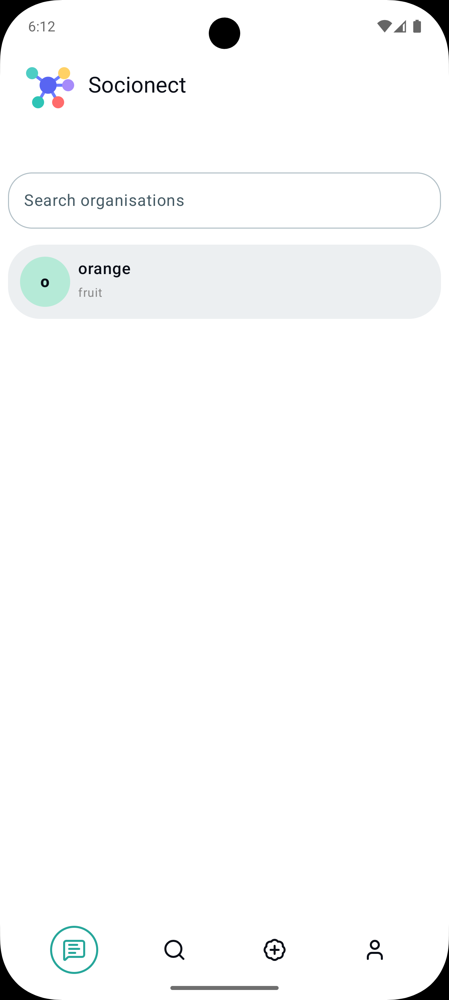
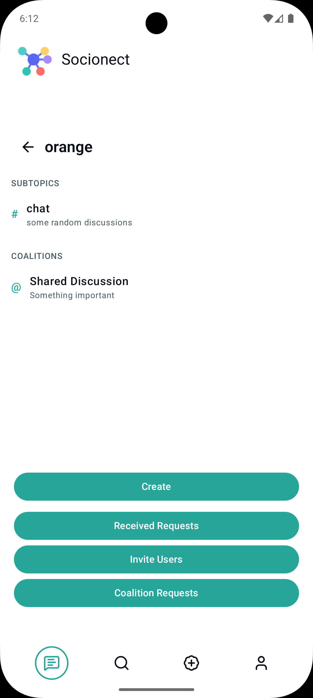
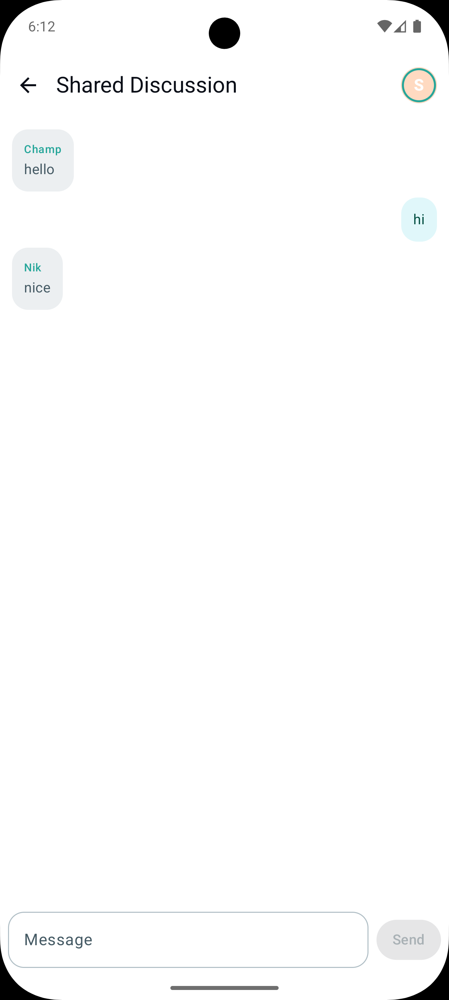
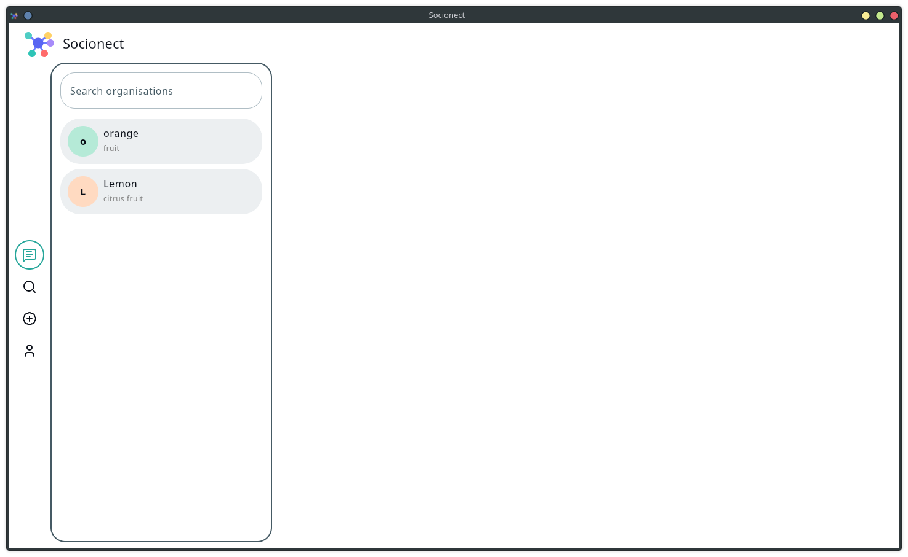
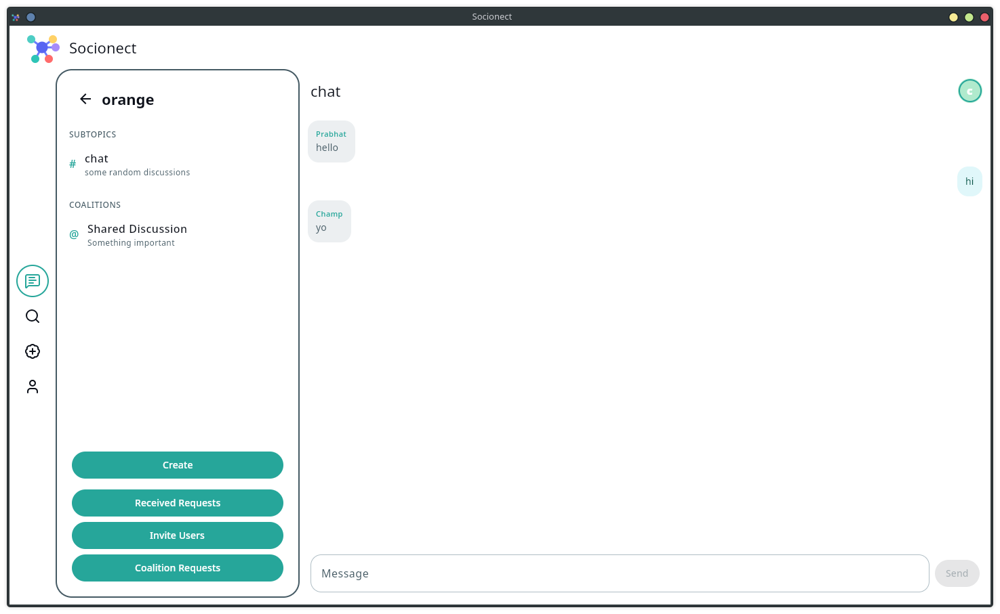

# Socionect

Socionect is a mutli-organisation communication platform (something like slack/discord with a small difference). There are organisations which are the base of socionect (something like server in discord) which users can join or be invited. Organisation contain subtopics where users can communicate or interact.

The main feature which makes Socionect different is Coalition. It is something like a subtopic but shared between multiple organisations. This completely removes the need for users to join multiple organisation to communicate or collaborate.

This Project was build for the Kotlin Multiplatform Contest 2026

## Motivation
In the second year of my college I joined the National Service Scheme and started contributing there. With NSS I got involved in various public service affairs with various NGO’s and faced a frustrating  problem that laid the foundation for Socionect. When we collaborated with an NGO then to communicate with them either we had to join their messaging groups or they had to join ours. This created a huge overhead before starting anything. Socionect solves this by coalitions.

## Features

1. Organised Communication  (like channels in discord)
2. Subtopics (to saperate different topics)
3. Coalitions (to support inter organisation communication)
4. Multiplatform support

## Screenshots

<p align="center">
  
  
  
</p>

<p align="center">
  
  
</p>

[Watch A short Walkthrough](https://drive.google.com/file/d/1t0XW4Sp-cCxNQRQvQJZH3BmityvcMeP1/view?usp=sharing)

## How to Run

### Build and Run Android Application

To build and run the development version of the Android app, use the run configuration from the run widget
in your IDE’s toolbar or build it directly from the terminal:
- on macOS/Linux
  ```shell
  ./gradlew :composeApp:assembleDebug
  ```
- on Windows
  ```shell
  .\gradlew.bat :composeApp:assembleDebug
  ```

### Build and Run Desktop (JVM) Application

To build and run the development version of the desktop app, use the run configuration from the run widget
in your IDE’s toolbar or run it directly from the terminal:
- on macOS/Linux
  ```shell
  ./gradlew :composeApp:run
  ```
- on Windows
  ```shell
  .\gradlew.bat :composeApp:run
  ```

### Build and Run Server

To build and run the development version of the server, use the run configuration from the run widget
in your IDE’s toolbar or run it directly from the terminal:
- on macOS/Linux
  ```shell
  ./gradlew :server:run
  ```
- on Windows
  ```shell
  .\gradlew.bat :server:run
  ```

### Build and Run Web Application

To build and run the development version of the web app, use the run configuration from the run widget
in your IDE's toolbar or run it directly from the terminal:
- for the Wasm target (faster, modern browsers):
    - on macOS/Linux
      ```shell
      ./gradlew :composeApp:wasmJsBrowserDevelopmentRun
      ```
    - on Windows
      ```shell
      .\gradlew.bat :composeApp:wasmJsBrowserDevelopmentRun
      ```
- for the JS target (slower, supports older browsers):
    - on macOS/Linux
      ```shell
      ./gradlew :composeApp:jsBrowserDevelopmentRun
      ```
    - on Windows
      ```shell
      .\gradlew.bat :composeApp:jsBrowserDevelopmentRun
      ```

### Build and Run iOS Application

To build and run the development version of the iOS app, use the run configuration from the run widget
in your IDE’s toolbar or open the [/iosApp](./iosApp) directory in Xcode and run it from there.


## Build Using

1. **Kotlin Multiplatform**
    - Shared business logic across Android, Desktop, Web, iOS, and Server
    - Single language & unified tooling for full-stack development

2. **Compose Multiplatform**
    - Declarative UI for Android, Desktop, and Web
    - Shared UI layer with platform-specific adaptations

3. **Ktor (Client & Server)**
    - Backend APIs, WebSockets, authentication, and content negotiation
    - Multiplatform HTTP client for app ↔ server communication

4. **Kotlinx Coroutines**
    - Structured concurrency for asynchronous and background tasks

5. **Kotlinx Serialization**
    - JSON serialization/deserialization for network and data exchange

6. **Kotlinx DateTime**
    - Multiplatform date and time handling

7. **Koin**
    - Dependency Injection for shared, Android, and server layers

8. **Exposed (SQL ORM)**
    - Type-safe database access
    - Supports PostgreSQL and SQLite

9. **PostgreSQL / SQLite**
    - PostgreSQL (supported need to enable)
    - SQLite for prototype

10. **Compose Navigation**
    - Navigation management for Compose Multiplatform UIs

11. **Multiplatform Settings**
    - Cross-platform key-value storage (preferences, tokens, flags)

12. **Napier**
    - Multiplatform logging abstraction

13. **Argon2**
    - Secure password hashing for server-side authentication


## License

This project is licensed under the [MIT License](LICENSE).